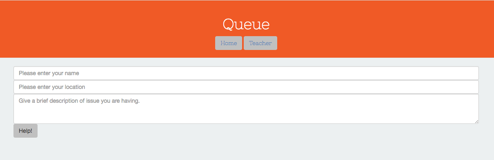
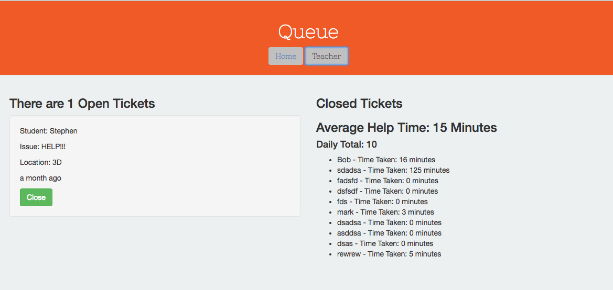

# Help Queue

#### _This is a student > teacher help queue web application. A student can submit a ticket with their name, issue and location, then the teacher can see this along with stats for the day and close the ticket once done dealing with student. This is a replica of Epicodus's Help Queue (https://epicodus-help.firebaseapp.com/) October 31, 2016_

#### By _**Stephen Burden**_

## Prerequisites
You will need the following things properly installed on your computer.

* [Git](http://git-scm.com/)
* [Node.js](http://nodejs.org/) (with NPM)
* [Bower](http://bower.io/)
* [Ember CLI](http://ember-cli.com/)
* [PhantomJS](http://phantomjs.org/)

## Setup/Installation Requirements
* _In the Terminal enter the following commands:_
  * `git clone https://github.com/spburden/qa-message-board-ember`
  * `cd <PROJECT-DIRECTORY>`
  * `npm install`
  * `bower install`
  * `ember serve`
* _To view the go to http://localhost:4200 in your web browser_

## Link
https://github.com/spburden/help-queue-ember

## Known Bugs
_There are no known bugs with this application._

## Support and contact details
_spburden@hotmail.com_

## Technologies Used
_Ember JS, JavaScript, JQuery, Node, npm, Bower, Gulp, Sass, HTML, CSS, and Bootstrap_

### License
The MIT License (MIT)

Copyright (c) 2016 **_Stephen Burden_**
